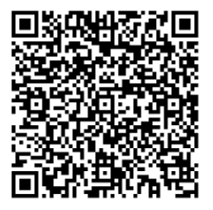
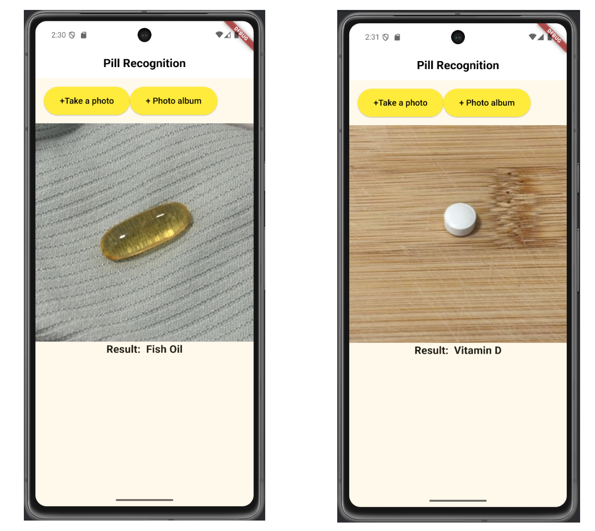

# A Deep Learning-Based Pill Recognition Application

An mobile APP for recognizing pills in photos, taking fish oil and vitamin D as examples.

## Data
under the "dataset" folder

## Model
under the "assets" folder

Edge Impulse project link: https://studio.edgeimpulse.com/public/677363/live 

## Deployment🚀
Method 1: Scan the QR Code



Method 2: clone this repository, open and run the under instructions with emulator:

```
flutter pub get
```

```
flutter run
```



